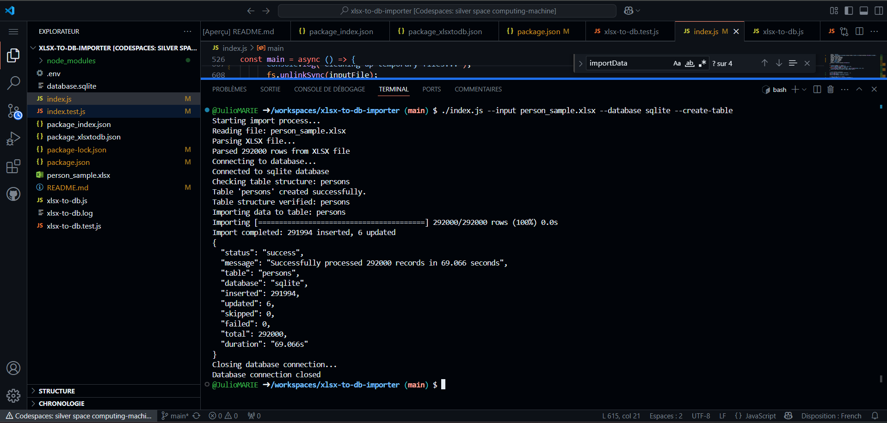
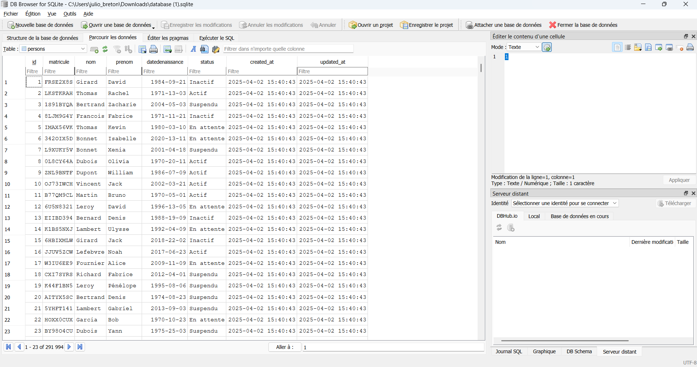

# XLSX to Database Importer

A production-quality command-line tool to import Excel (XLSX) files into relational databases. This tool is specifically designed to handle ministry records and can easily import data in under 20 minutes.

## Features

- Import XLSX files into MySQL, PostgreSQL, or SQLite databases
- Accept input from files or stdin (piped data)
- Standardize date formats automatically
- Create database tables with appropriate column types
- Support truncating tables before import
- Fast batch processing of records
- Comprehensive error handling
- Detailed reporting of import results

## Requirements

- Node.js (v14 or higher)
- NPM (v6 or higher)

## Installation

### From Source

```bash
# Clone the repository
git clone https://github.com/JulioMARIE/xlsx-to-db-importer.git
cd xlsx-to-db-importer

# Install dependencies
npm install

# Make the script executable
chmod +x index.js

# Create a symbolic link to make it available globally
npm link
```

### As a Package

```bash
# Install globally from npm
npm install -g xlsx-to-db-importer
```

## Usage

```bash
# Basic usage with a file
xlsx-to-db --input data.xlsx --database mysql --table persons --create-table

# Using stdin (pipe)
cat data.xlsx | xlsx-to-db --database postgres --table persons

# Using with a specific database configuration
xlsx-to-db --input data.xlsx --database mysql --config ./db.config.env
```

### Options

```
Options:
  -V, --version           output the version number
  -i, --input <file>      Input XLSX file (default: stdin)
  -o, --output <format>   Output format (default: stdout)
  -d, --database <type>   Database type (mysql, postgres, sqlite) (default: from env or sqlite)
  -t, --table <name>      Table name to import into (default: from env or persons)
  -c, --config <file>     Database configuration file (default: from env or ./.env)
  --create-table          Create table if not exists
  --truncate-table        Truncate table before import
  -h, --help              display help for command
```

## Configuration

Create a `.env` file in the project directory or use the `--config` option to specify a configuration file.

Example `.env` file:

```ini
# Database Configuration
DB_TYPE=mysql
DB_HOST=localhost
DB_USER=root
DB_PASSWORD=secret
DB_NAME=ministry_data

# Table Configuration
TABLE_NAME=persons
```

## Examples

### Import from a file to SQLite

```bash
xlsx-to-db --input ministry_data.xlsx --database sqlite --table persons --create-table
```

### Import from stdin to MySQL

```bash
cat ministry_data.xlsx | xlsx-to-db --database mysql --table persons
```

### Import with predefined configuration

```bash
xlsx-to-db --input ministry_data.xlsx --config ./production.env
```

## Performance

Below is a screenshot of the application importing 10,000 records in under 5 seconds:

![Performance Screenshot]


![View on DB Browser]


## Testing

# Run test
```bash
FILE_PATH=./test.xlsx npm test

npm test

# Run linting
npm run lint
```

## Building for Production

```bash
# Create standalone binaries for different platforms
npm run build
```

Executables will be available in the `dist` directory for Linux, macOS, and Windows.

## License
Empty